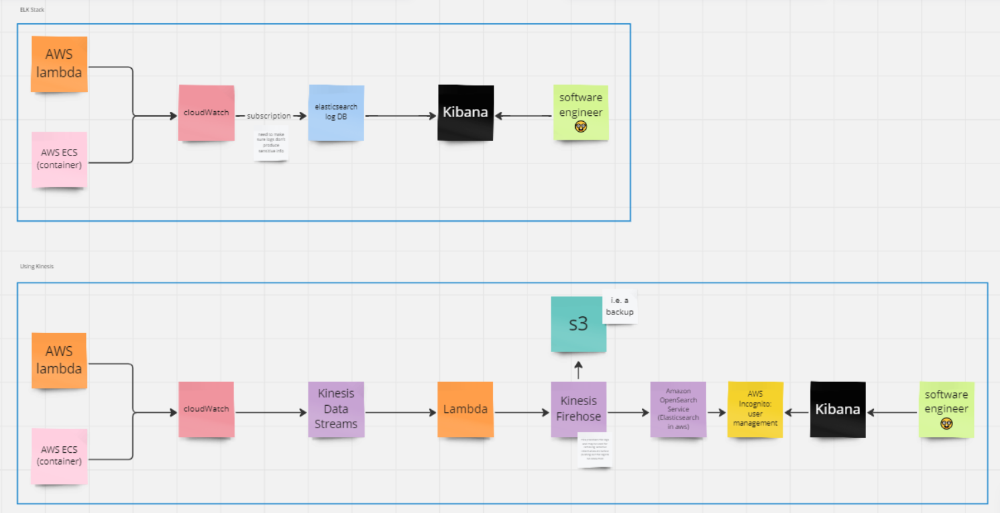

# Building Microservices-based Systems in AWS with .NET and C# 

Miro link to architecture diagram: https://miro.com/app/board/uXjVK2b3cDI=/?share_link_id=716309992364 

- 92% of enterprises uses public cloud (aws, azure etc)
- AWS has the largest market share (9%)
- 75% of companies were using or planning to use event-driven architecture 

The course has:
- understand concepts and design pattersn for secure, scalable, available and resilient systems
- design system architecture based in microservices in AWS 
- code and event-driven microservices with C#

Contents:
- [Introduction to Microservices](#introduction-to-microservices)
- [Hotel booking system](#hotel-booking-system)
- [Identity and Access Management (IAM) AWS Cognito](#identity-and-access-management-iam-aws-cognito)
- [API Gateway](#api-gateway)
  - pattern
  - creating a mock API with AWS Gateway
  - Authenticating API Requests
- [Building Serverless Microservices](#building-serverless-microservices)
  - [Serverless & Containerisation: The Microservice Chassis](#the-concept-of-a-microservice-chassis--servelress--containerisation)
  - [Creating and deploying AWS Lambda](#creating-and-deploying-an-aws-lambda-microservice)
  - [Capturing Request Body in AWS Lambda](#capturing-the-request-body-in-aws-lambda-as-an-api-backend)
  - [Storing Data and files in AWS](#storing-data-and-files-in-aws)
  - [Create and configure s3 buckets](#create-and-configure-s3-buckets)
  - [Uploading files and images to s3](#uploading-files-and-images-to-aws-s3)
  - [Creating and configuring DynamoDB](#creating-and-configuring-a-dynamodb-table)
  - [Storing info in DynamoDB](#storing-information-in-dynamodb)
  - [Connecing API Gateway to Lambda via Proxy Resource](#connecting-api-gateway-to-lambda-via-a-proxy-resource)
  - [Domains and Boundaries](#domains-and-boundaries)
  - [Creating a Restful GET Api with Lambda](#creating-a-restful-get-api-in-api-gateway-with-a-lambda-microserivce)
  - [Exploring JWT and JWKS](#exploring-jwt-and-json-web-key-sets-jwks)
  - [Protecting a GET API with Lambda Authorizers](#protecting-a-get-api-with-lambda-authorizers)
  - [Command Query Responsibility Segregation - CQRS Pattern](#cqrs-pattern)
  - [Fan Out Pattern and Idempotent Consumer Patterns](#fan-out-pattern-and-idempotent-consumer-patterns)
  - [Update code of AddHotel Lambda to publish an SNS event](#update-code-of-addhotel-lambda-to-publish-an-sns-event)
  - [Setting up ElasticSearch for Search Microservice](#setting-up-elastic-search-for-search-microservice)
  - [Implementing the Idempotent Consumer Pattern](#implementing-the-idempotent-consumer-pattern)
  - [Subscribing a microservice to Event bus](#subscribing-a-microservice-to-event-bus)
- [Building Containerised microservices](#building-containerised-microservices)
  - [Intro to Containerised Microservices](#intro-to-containerised-microservices)
  - [Create the search containerised microservice](#create-the-search-containerised-microservice)
  - [Creating a docker image](#creating-a-docker-image)
  - [Push to AWS ECR (Elastic Container Registry)](#push-to-aws-ecr-elastic-container-registry)
  - [Deploying to AWS ECS (Elastic Container Service)](#deploying-to-aws-ecs-elastic-container-service)
  - [Creating a Proxy API for a containerised microservice](#creating-a-proxy-api-for-a-containerised-microservice)
  - [Creating an API for a containerised microservice with a private IP](#creating-an-api-for-a-containerised-microservice-with-a-private-ip)
- [The Event Sourcing Pattern for Ultimate System Resiliancy (hotel booking!)](#the-event-sourcing-pattern-for-ultimate-system-resiliancy)
  - [Event Sourcing microservice](#event-sourcing-microservice)
  - [booking microservice](#booking-microservice)
  - [Creating the review booking microservice](#creating-the-review-booking-microservice)
  - [The Sidecar Pattern](#the-sidecar-pattern)
- [Logging for Microservices](#logging-for-microservices)
  - [Logging Solutions in AWS](#logging-solutions-in-aws)
- [The Saga Pattern](#the-saga-pattern)
  - [Why message-oriented architecture?](#why-message-oriented-architecture)
- [Event Streaming Platforms: Apache Kafka, AWS MSK](#event-streaming-platforms-apache-kafka-aws-msk)
  - [What problem does event streaming solve?](#what-problem-does-event-streaming-solve)
- [Message Oriented Microservices with RabbitMQ](#message-oriented-microservices-with-rabbitmq)
- Interview Questions
  - [Alternatives to Monolithic Applications](#alternatives-to-monolithic-applications)
  - [Whats the Anatomy of a microservice-based system](#whats-the-anatomy-of-a-microservice-based-system)
  - [Explain the Monolithic, SOA and Microservices Architectures](#explain-the-monolithic-soa-and-microservices-architectures)
  - [What is Bounded Context?](#what-is-bounded-context)

---

### Local Dev
- open IIS, right-click sites and add new website 
  - specify the path as this repo (the frontEnd folder)
  - bind it as http - localhost - 6060 
- open up localhost:6060
  - create new user 

---

## Introduction to Microservices

### Microservice vs Monolithc applications

monolithic => services orientated (maintain session / state, SOAP APIs) => microservices (stateless => but use events / messages or restful APIs)

Microservices:
- UI (client side, written in react e.g.)
- Individual services with their own database 
  - if need to use each others API, use restful API. prefer events / messages over API usage

### Anatomy of an event-driven microservices-based application

- system has a user. accesses our app via web or mobile app built using JS framework (react, angular)
- backend is then made of microservices:
  - i.e. product microservice, cart microservice, payment microservices. exposed by restful APIs
  - we have an abstraction infront of the microservices (API Gateway)
  - firewall between UI as well. i.e. UI => firewall => API gateway => various microservices
- to minimise API usage between microservices, we use an event bus. 
  - event bus is like a queue
  - microservices that have something to say push to the event bus, to upload data. 
  - microservices that need to read this data and pull from the event bus.
  - the microservices don't talk to each other directly 
- if a user needs to login, we also need an identity provider (IDP) / authentication
  - microservices also need to validate against this IDP. authentication can be delegated to the API gateway

---

## Hotel Booking System

- 3 types of users:
  - system admins - can do anything
  - customers - can sign up, sign in, perform search
  - hotel managers - see lists of bookings and accept or reject bookings
- architecture:
  - identity provider (Defines users / auth details)
  - hotels microservice (CRUD actions on hotels) + DB
  - search microservice 
  - payment microservice (we won't integrate with any payment service)
  - booking microservice + DB
  - admin microservice 

---

## Identity and Access Management (IAM) AWS Cognito

### Intro to AWS Cognito
- user identity and access management 
- provides user identity, user authentication via email or Federated Access (fb or google)
- users can have attributes (ie names and address), groups and other attributes
- users can be created manually by an admin or via a sign-up page 
- AWS cognito provides built-in signup and login page for web apps 
- AWS cognito based on Open Authentication (OAuth)

### Setting up AWS Cofnito for Hotel Booking System
- go to cognito in AWS => "create user pool"
  - various options here
  - using cognito domain and the cognito generated UI: https://hotel-booking-serivce.auth.ap-southeast-2.amazoncognito.com
  - for 'allowed callback urls' make sure we don't run our website as a file. i.e. file://user/local etc => need to setup a web server, i.e. IIS / apache tomcat 
    - this is the URL to redirect the user back to after authentication. i.e. https://localhost:8080/hotel
  - in the 'OpenId Connect Scopes' (in 'advanced app client settings') we need OpenId and Email
  - add sign-out URL (the same i.e. https://localhost:8080/hotel)
  - once created we need 'user pool id' (at the top) and the client id (in 'App integration' section)
  - we also need a user to administer other uers
    - in users tab, create user 
    - we've got 3 users: admins, customers, and managers. any user not part of a group we assume are customers
  - do make our user an admin, we to go groups and create group:
    - create 'Admin' group as well as 'HotelManager' group

### Sign in with AWS Cognito 
- to integrate with a front end app, in aws in the cognito user pool click 'getting started' then 'integrate your user pool with an app': https://docs.aws.amazon.com/cognito/latest/developerguide/cognito-integrate-apps.html
- Amplify works with react: https://docs.aws.amazon.com/cognito/latest/developerguide/cognito-integrate-apps.html#cognito-integrate-apps-amplify
- gives you boilerplate JS 
- instead we'll use very basic JS that the course guy provides => add my details to the cognito.js file 
  - back in the amazon cognito area in AWS, click into the 'App integration' tab then the 'app client name' then edit hosted UI. change the OAuth 2.0 Grant types to 'Implicit grant' as well.
- then he goes to the html page (in my case its doing the file thing just opening index.html) - so need to use IIS for windows. 
  - just used chatgpt to figure that out, its now on http://localhost:6060/hotel => make sure this is the same in the Cognito UI (i had https://localhost:8080/hotel and it didn't work)


### Creating hotels 
- sign in as an admin user (the one we made earlier)
- 'add hotel' button now visible
- click it and you see a basic form, in addHotel.html. this doesn't have an action yet - we need the API for it first. note the encryption type.  (enctype)

---

## API Gateway 

### API Gateway Pattern and Tools
- stops the consumer of a microservice from directly accessing it 
- simplifies the systems interface by combining multiple APIs to one 
- can perform authentication and authorization (instead of all the microservices needing this)
- simplifies monitoring (instead of all the microservices needing this)
- API catalogue and documentation 

common api gateway tools:
- aws api gateway:
  - part of AWS
  - easy to learn
  - no complex setup (cloud formation or can use console / UI)
  - needs to be created per API 
- google Apigee
  - enterprise level / use (costly)
  - supports various deployment models 
  - hybrid cloud (i.e. aws and on local data centres)
  - complex
- Kong
  - enterprise level (very expensive)
  - high throughput

### Create a Mock API with AWS API Gateway
- will create one and use it for the addHotel.html form 
- go to api gateway in aws console => create REST API => build => name it "newHotelApi" => create
- all the API definitions will be in the 'resources', but we need to deploy the API to stages first  
- "create method" will create an API
  - choose post 
  - it can go to lambda, http, mock, aws service, vpc link... we'll use mock + create 
  - we can click test as well 
- to deploy this, click deploy and make a new stage. make stage name 'test'
  - once deployed, you can see an invoke URL. paste this in the addHotel.html form. 
  - when we go to submit the form, we get a 500 error. its because the mock only accepts application/json but our form is sending 'multipart/form-data'. in resources => post => integration request => mapping templates we can edit this and add a new mapping template for multipart/form-data. then we need to re-deploy
  - now when we submit the form its a 403 CORS error. in the resource details click 'enable cors' and tick POST, confirm with save and redeploy
  - now it responds with 200 OK

### Authenticating API Requests 
- we don't want our API open to the public, only if they have a user and password in our system (authentication) - and authorise them that this API is relevant to them (authentication).
-  in API gateway click on the authorizers tab
  - click create an authorizer and choose cognito as the type, and select the one we made earlier
  - name it and add to the token source "Authorization", and test it. without a token it should be 403, with a token (this is logging from cognito)
- we now need to go to resources/post and click on the 'method request' and add the authorization to it 

---

## Building Serverless Microservices 

### The concept of a microservice Chassis :: Servelress & Containerisation 
- every microservice has a "service template build logic" and "cross cutting concerns" (i.e. security, external config, logging / monitoring, health check, tracing)
- we want to take out all cross-cutting concerns and leave them to an external entity: the chassis
  - a microservice chassis is the foundation for developing microservices and performing cross-cutting tasks 
  - if we look at an example of an "order service":
    - service specific build logic
    - service-specific cross-cutting concerns
    - application logic
    - template build logic 
    - template cross-cutting concerns
  - we can see it can use some DRY template, anything that is common goes to the "Service Chassis" or the "Service Template" 
- the types of Chassis tells us what kinds of service we can create 

Types of microservices (Chassis and templates)  
- Serverless
  - specific to cloud envs
  - AWS provides the chassis 
  - scaling-out based on usage and is done fully controlled by AWS 
  - fully integrated into other AWS services (IAM, CloudWatch, etc)
  - we do not have access to the execution environment 
  - dev languages / frameworks based on AWS offering only
- Containerized 
  - app and its operating system packaged into one image, i.e. a docker image
  - must be deployed to a container orchestration playform, i.e. kubernetes
  - access to execution environment, i.e. via ssh 
  - no limitation for development languages or technologies 
  - can support complex deployment scenarios effectively, i.e. blue/green deployment
- Other Chasis types:
  - spring boot / micronaut / quarkus (java)
  - express.js (node.js)
  - flask (python)
- in AWS:
  - AWS lambda is the microservice framework (including chassis and template) for creating serverless microservices
  - AWS supports kubernetes (as a managed service) and has its own containerisation platform called ECS (elastic container services) for container-based microservices 

### Creating and deploying an AWS Lambda microservice 
- to start with, we need to know the payload: what our hotel form is pushing to API gateway. check this in the network tab on the browser. 
- in AWS Lambda service in the console, we see we can use .net 8.0 
- need to create the lambda: in rider, create new project and choose 'class library' - all lambdas are class libraries 
- using nuget add `amazon.lambda.core` as well as `amazon.lambda.apigatewayevents`, `amazon.lambda.serialization.systemtext.json`
- add the response headers, and the assembly for the lambda serialisers. its in the "HotelManager_HotelAdmn/HotelAdmin.cs" file 
- to package this and send to AWS, use this terminal command: `dotnet tool install -g Amazon.Lambda.Tools`
  - go to where csproj file is, then use `dotnet lambda package HotelManager_HotelAdmin.csproj -o HotelAdmin.zip`
  - creates a file 'HotelAdmin.zip'

- now we want to upload our zip file to AWS 
- go to create the lambda in the AWS UI, add the name and use runtime .net 8
- in the code tab, upload .zip file from earlier
- we then need to change the handler in the runtime settings - this is the endpoint where AWS looks to access the code.
  - for .net it works like this: `<Assembly name>::<namespace name>.<class name>::<method name>`
  - i.e. ours will be "HotelMAnager_HotelAdmin::HotelManager_HotelAdmin.HotelAdmin::AddHotel"
- we can then go to the test tab and press test, and see that its working
- we can also go to the 'monitor' tab to see the cloudwatch logs 

### Capturing the Request body in AWS Lambda as an API Backend
- install using nuget `HttpMultipartParser` 
- to get the information out of our form:

````c#
// below is from HotelAdmin.cs "AddHotel"
var bodyContent = request.IsBase64Encoded
    ? Convert.FromBase64String(request.Body)
    : Encoding.UTF8.GetBytes(request.Body);

using var memStream = new MemoryStream(bodyContent);
var formData = MultipartFormDataParser.Parse(memStream);

// strings are from the html frontend file names
var hotelName = formData.GetParameterValue("hotelName");
var hotelRating = formData.GetParameterValue("hotelRating");
var hotelCity = formData.GetParameterValue("hotelCity");
var hotelPrice = formData.GetParameterValue("hotelPrice");

var file = formData.Files.FirstOrDefault();
var fileName = file.FileName;
// file.Data 

var userId = formData.GetParameterValue("userId");
var idToken = formData.GetParameterValue("idToken");

// we pass the json web token in both the headers and 
var token = new JwtSecurityToken(jwtEncodedString: idToken);
var group = token.Claims.First(x => x.Type == "cognito:groups");

if (group == null || group.Value != "Admin")
{
    response.StatusCode = 401;
    response.Body = JsonSerializer.Serialize(new { Error = "Unauthorised. Must be a member of admin group" });
}
````
- we need to deserialize the JWT authentication token
  - need to install using nuget `System.IdentityModel.Tokens.Jwt`

### Storing Data and files in AWS
- i.e. how to store the hotels image in AWS 
- database or file storage
  - relational db or no-sql db
    - aws RDS offers relational databases, i.e. mySQL as a managed service 
    - DynamoDB is no-sql. data is stored as json
    - one RDS instance is OK, however each microservice MUST have its own db
    - no cross-database queries or access
  - file storage
    - S3 is used for storing files 
    - AWS Elastic file system is used for short-term storage
- the flow looks like this:
  - user uploads file to browser, which calls the api gateway, which calls lambda, which then tries to upload to the s3 file storage (for the image) and puts additional information (name etc) in the database 
  - by default lambda does not have access to s3 or db, we need to use IAM to give it permissions and give this role to our lambda. called an "execution role"
- go to IAM: create role, aws service, lambda. Give it access to cloudwatch, s3, dynamoDB
  - named "HotelAdminLambdaExecutionRole"
- go to Lambda
  - find our addHotel lambda, go to configuration tab, then permissions tab, edit and change the lambda execution role to the one we just made

### Create and Configure S3 Buckets
- go to s3, create bucket, give it a name and untick 'block all public access'
- need to add a policy to the bucket, he's done it for us here: https://github.com/aussiearef/MicroservicesWithAWS/blob/main/S3-Policy.json
  - need to include our bucket arn and our IAM arn ^

### Uploading Files and Images to AWS S3
- to upload to s3 we can use the nuget package `awssdk.s3`
- in the lambda:
````c#
await using var fileContentStream = new MemoryStream();
await file.Data.CopyToAsync(fileContentStream);
fileContentStream.Position = 0;

var region = Environment.GetEnvironmentVariable("AWS_REGION"); // pre-defined env variable available to all lambdas
var bucketName = Environment.GetEnvironmentVariable("bucketName");

// using the actual s3 sdk:
var client = new AmazonS3Client(RegionEndpoint.GetBySystemName(region));
await client.PutObjectAsync(new PutObjectRequest
{
    BucketName = bucketName,
    Key = fileName, // name of the file
    InputStream = fileContentStream,
    AutoCloseStream = true
});
````
- the AWS_REGION env variable exists by default on all lambdas, but we will need to make the "bucketName" variable of our s3 bucket ourselves in the UI. 
  - lambda => configuration => environment variables => add

### Creating and configuring a dynamoDB table
- dynamoDB => create table => name it 
  - it needs a partition key which refers to where data is stored in shards
    - i.e. we can use the admin's userId and store all the hotels created by that user in one location. or we could use the cityName - the user wants to see all the hotels in Paris for e.g. we will use userId
  - sort key is optional but improves perfomance, sort through the items listed under a specific partition key.
  - everything else is fine, create table

### Storing Information in DynamoDB
- firstly our putObjectAsync into s3 could fail, we need to wrap that in a try/catch block 
- need to install the dynamo SDK: `AWSSDK.DynamoDBv2`
- create a model/Hotel.cs model 
- hook it up in the code:
````c#
var dbClient = new AmazonDynamoDBClient(RegionEndpoint.GetBySystemName(region));

try
{
    var hotel = new Hotel
    {
        UserId = userId,
        Id = Guid.NewGuid().ToString(),
        Name = hotelName,
        CityName = hotelCity,
        Price = int.Parse(hotelPrice),
        Rating = int.Parse(hotelRating),
        FileName = fileName
    };

    using var dbContext = new DynamoDBContext(dbClient);
    await dbContext.SaveAsync(hotel);
}
````

### Connecting API Gateway to Lambda via a Proxy Resource
- our API in api gateway is just a mock API now - just connected to a mock
- we want to attach our AddHotel lambda to our API 
- when you create an API - if the request is a POST of PUT that has headers/body, the header/body will not be forwarded to the lambda
  - not a problem for GET, but it is for PUT and POST 
  - in order to forward the headers and body, we need to create a 'proxy resource'
- go to the API in the API Gateway, click on the exisitng POST resource, then click actions, then resource. tick to create a proxy resource, add a resource name like 'admin' , and tick CORS
  - resource path needs a specific format called "greedy format" like `{Admin+}`
  - after this is made, you should see /{Admin+} under POST - click on any, then click edit integration
  - select Lambda function, find the lambdas ARN, add the execution role we made earlier, save 
- click method request
  - make the authorisation "NewHotelAuth" (which we used before in incognito)
- in the OPTIONS area - this is only used for pre-flight to see if CORS headers are working. 
  - integration request for OPTIONS can be mock, just make sure the mapping application/json request is returning the cors headers, i.e.
````json
{ 
  statusCode: 200, 
  headers: {
    "Access-Control-Allow-Headers": "*",
    "Access-Control-Allow-Origin": "*",
    "Access-Control-Allow-Methods": "*"
  }
}
````
- OPTIONS returns the CORS headers in the `integration request`
- ANY in the `integration request` has the lambda proxy (also must return CORS headers - this is in our C# code), and the `method request` uses the incognito auth 
- now we deploy the changes
  - to test them, we must open the /{admin+} to find the invoke URL to use
  - add this URL to the addHotel.html form action
  - sign in, go to add hotel, check network tab. preflight request works, lambda seems to fail. can run this in the proxy POST test area, seems IAM issue
  - needed to add apigateway to the IAM role:
  ````
  "Principal": {
    "Service": [
        "apigateway.amazonaws.com",
        "lambda.amazonaws.com"
    ]
  }
  ````
- had some issues here, had to remake the API Gateway and it worked - might have picked the wrong role or something. This was the solution on stack overflow :/
- once its working, should be able to go to s3 and see the image. and also go to dynamoDB to see the 


### Domains and Boundaries 
- now we can create a hotel, storing the image in s3 and the data in dynamoDB
- we want to now see all the hotels created, i.e. using GET
- do we need a new lambda/microservice for this or can we just add a new method to our existing lambda function? 
  - in OOP we have 'single responsibility principle' - each entity must do only one job. not so simple in microservices... we need to know the domain and the domain boundary.
  - a domain is a specific area of business or application functionality. the limit that separates domains is called the "domain boundary"
  - we have a entity called HOTEL. an Admin adds,edit,deletes hotels. A customer searches for hotel / books. A hotel manager views bookings and approves bookings. 
  - the HOTEL entity means different things to different users, in this case the meaning is the domain, i.e.: admin domain, customer domain, booking management domain
    - i.e. we could have one microservice for ADMIN domain that does get/add/edit/delete of hotels
    - one that does CUSTOMER domain searching/booking 
    - one that does BOOKING MANAGEMENT domain viewing bookings, approving bookings
  - to improve scalability / performance, we pay need to break a microservice down further forever. and if a domain is quite large.
- "Each microservice is designed to handle a specific business capability"
- "Domain boundary separates one microservice from another and ensures each microservice is responsible for a specific set of business capabilities"
- By defining clear domain boundaries, microservices can be independently developed / developed / scaled which improves the agility and scalability of the overall system

- given the above, we'll add the GET to our existing microservice.

### Creating a Restful GET API in API Gateway with a Lambda microserivce
- Add new function to HotelManager_HotelAdmin `HotelAdmin.cs`:
````c#
    public async Task<APIGatewayProxyResponse> ListHotels(APIGatewayProxyRequest request)
    {
        // query string param called token is passed to this lambda method.
        var response = new APIGatewayProxyResponse()
        {
            Headers = new Dictionary<string, string>(),
            StatusCode = 200
        };
        
        response.Headers.Add("Access-Control-Allow-Origin", "*");
        response.Headers.Add("Access-Control-Allow-Headers", "*");
        response.Headers.Add("Access-Control-Allow-Methods", "OPTIONS,GET");
        response.Headers.Add("Content-Type", "application/json");

        var token = request.QueryStringParameters["token"]; //jwt
        var tokenDetails = new JwtSecurityToken(jwtEncodedString: token);
        var userId = tokenDetails.Claims.FirstOrDefault(x => x.Type == "sub"); // OAuth thing, always carrys the unique id of the user
        
        var region = Environment.GetEnvironmentVariable("AWS_REGION"); // pre-defined env variable available to all lambdas
        var dbClient = new AmazonDynamoDBClient(RegionEndpoint.GetBySystemName(region));
        
        try
        {
            using var dbContext = new DynamoDBContext(dbClient);
            var hotels = await dbContext.ScanAsync<Hotel>(new[] { new ScanCondition("UserId", ScanOperator.Equal, userId) })
                .GetRemainingAsync();
            response.Body = JsonSerializer.Serialize(hotels);
        }
        catch (Exception e)
        {
            response.StatusCode = 400;
            Console.WriteLine(e);
        }

        return response;
    }
````
- now we need to create a new lambda function in AWS, because we want a separate API that returns this list of API (needs to point to this new method)
  - created this 'ListHotels', gave it correct execution role, uploaded ZIP file 
  - updated handler to point to `HotelMAnager_HotelAdmin::HotelManager_HotelAdmin.HotelAdmin::ListHotels`

````
Creating the Lambda Function
- Get the code of the HotelMan_HotelAdmin project from GitHub (or write it yourself following several previous lectures).
- Package the code using the "dotnet lambda package HotelMan_HotelAdmin.csproj -o HotelAdmin.zip" command. This command will create HotelAdmin.zip, including all the files required to complete the Lambda function.
- Log in to AWS Console.
- Make sure you have created and configured the DynamoDB table before.
- Go to Lambda service.
- Then create a new Lambda function called ListAdminHotels and upload the HotelAdmin.zip file as its code (use dotnet 6 as runtime).
Go to the Code table, and under the Runtime Settings section, edit the Handler attribute and point it to HotelMan_HotelAdmin::HotelMan_HotelAdmin.HotelAdmin::ListHotels

Creating and Assigning the Execution Role
- Now you must create an execution IAM Role and assign it to Lambda.
- Go to IAM service.
- Go to the Roles tab.
- Create a new Role.
- Choose Lambda as your use case.
- In the Permissions step, add the AmazonDynamoDBReadOnlyAccess policy to the Role.
- Click on Next and provide a name for your Role. i.e., ListAdminHotelsExecutionRole.
- Once the Role is created, go back to Lambda service.
- Find the ListAdminHotels function and click on it.
- Go to the Configuration tab.
- On the left side of the screen, click on the Permissions tab.
- Edit the Execution Role and assign ListAdminHotelsExecutionRole as the execution role of the Lambda.
````
- now we need to create a new API Gateway 
````
Creating a Proxy REST API in AWS API Gateway
This practice will teach you to pass Query String parameters to your Lambda function.
- Login to AWS Console.
- Go to the API Gateway service's dashboard.
- Click on the "Create API" button and then choose REST API. Then click on the Build button.
- Call the new API as ListAdminHotels.
- From the Actions drop-down, choose Create Method and add a GET method to the API.
- Ensure "Use Lambda Proxy integration" is enabled when creating the GET method.
- Choose the "Lambda Function" as the integration type of the API.
- Enable "Use Lambda Proxy integration."
- In the Lambda Function box, type L so the ListAdminHotels appears. Then select it.
- Click on the Save button, then click on OK.
- From the Actions drop-down button, select Enable CORS.
- Click on the "Enable CORS and replace existing CORS headers" button.
- Click on Resources on the left side of the screen. The GET and OPTIONS methods will appear.
- Click on Options.
- Click on Integration Request.
- Expand Mapping Templates.
- Click on application/json.
- A box appears. Add the response code (200) and the CORS headers. Allow OPTIONS and GET. You can use the example template from this address and change it as required: https://shorturl.at/ikCDZ
- Click on Save.
- DO NOT configure authorization for this API.
- Create a Proxy resource with a path like {listadminhotels+}.
- Enable "Configure as a proxy resource" and "Enable API Gateway CORS".
- Set Resource Path to "{listadminhotels+}" and Resource Name to "listadminhotels".
- Once the resource is created, click on "ANY" (under the resource path {listadminhotels+}) and connect it to the ListAdminHotels Lambda function. Then click on Save.
- Under the resource of your method, click on ANY to see the "Method Execution" page (where four boxes are seen).
- Click on the "Method Request" box.
- Then, expand "URL Query String Parameters" in the Method Request page.
- Click on the "Add query string" button.
- type in "token" in the name field. Then click on the tick button on the right to save.
- Enable the "required" option.
- Click on OPTIONS under the created resource.
- Make sure its integration type is MOCK and its Integration returns the HTTP 200 and the CORS headers.
- Deploy your API to a new Stage (i.e., Test).
- Make a GET request to the Invoke URL of the GET proxy resource.
````


NOTE: Some issue with the s3 upload. seems to work manually uploaded into s3, so going from the form to the c# lambda to the s3 seems to be a problem. Guys code is here: 
https://github.com/aussiearef/MicroservicesWithAWS_Dotnet_HotelMan/blob/main/HotelMan_HotelAdmin/HotelMan_HotelAdmin/HotelAdmin.cs

### Exploring JWT and JSON Web Key Sets (JWKS)
- we've now got a POST (new hotel) and GET (list admin hotels) methods
- lambda authorisers vs cognito:
  - lambda authorisers are lambda functions: when a client tries to access a resource behind api gateway, api gateway triggers the lambda auth function, and says if the user has the right to access the api or not.
  - cognito authorisers can only perform authentication, lambda authorisers we can validate the token as well as check if the user has the correct rights (i.e. part of the admin group - authentication AND authorization)
    - in our POST, the authorization was done in the lambda logic itself in the `AddHotel` method.
    - if we want to defer the authorisation completely to API Gateway (and not perform it in the microservice code), lambda authorisers are the way to go.
      - in the POST method we had a check `if (group == null || group.Value != "Admin")` using cognito, but in this GET we will use a lambda authoriser 

- to create a new lambda authoriser in API Gateway, go to the api then click 'authorizers' and 'create authorizer'
  - make it lambda, the token source should be "Authorization" for POST / PUT. we could make it a request instead of a token, i.e. for a GET we could pass the token through a query string called "token". 

- we can pull the JWT out of the localstorage on the browser and chuck it in jwt.io to decode it
  - we can see in the header: the kid (id of a private key made and stored by aws cognito), "alg" is the encryption algorithm, 
  -  in the body the aud (audience), iss (issuer)
  - documentation on doing this: https://docs.aws.amazon.com/cognito/latest/developerguide/amazon-cognito-user-pools-using-tokens-verifying-a-jwt.html
  - need to use this: `https://cognito-idp.<Region>.amazonaws.com/<userPoolId>/.well-known/jwks.json`
    - returns a JSON, there are two keys: one to sign access key, another to sign idToken
    - we can compare the kid's to see which one is used to sign the idToken, and grab that one to validate the JWT
    - we can use secrets manager, create a new secret of the key, choose 'other type of secret' and paste the whole key into the Plaintext area
      - now to access this from our lambda, we need a lambda execution role that has access to secrets manager 
      - jwt.io has a libraries section which has lots of libraries for all coding languages to validate tokens  (installed below)

### Protecting a GET API with Lambda Authorizers 
- create a new class library 'LambdaAuthorizer'
- install nuget packages: `amazon.lambda.core`, `amazon.lambda.apigatewayevents`, `awssdk.secretsmanager`, `System.identitymodel.tokens.jwt`
- Lambda Authorizer code:
````c#
using System.IdentityModel.Tokens.Jwt;
using System.Text.Json;
using Amazon.Lambda.APIGatewayEvents;
using Amazon.SecretsManager;
using Amazon.SecretsManager.Model;
using Microsoft.IdentityModel.Tokens;

namespace LambdaAuthorizer;

public class Authorizer
{
    public async Task<APIGatewayCustomAuthorizerResponse> Auth(APIGatewayCustomAuthorizerRequest request)
    {
        // in api gateway UI we have 'request' and query string param as 'token' in the lambda event payload, which populates:
        var idToken = request.AuthorizationToken;
        var idTokenDetails = new JwtSecurityToken(jwtEncodedString: idToken);

        var kid = idTokenDetails.Header["kid"].ToString();
        var issuer = idTokenDetails.Claims.First(x => x.Type == "iss").Value;
        var audience = idTokenDetails.Claims.First(x => x.Type == "aud").Value;
        var userId = idTokenDetails.Claims.First(x => x.Type == "sub").Value;
        
        var response = new APIGatewayCustomAuthorizerResponse()
        {
            PrincipalID = userId,
            PolicyDocument = new APIGatewayCustomAuthorizerPolicy()
            {
                Version = "2012-10-17",
                Statement = new List<APIGatewayCustomAuthorizerPolicy.IAMPolicyStatement>()
                {
                   new APIGatewayCustomAuthorizerPolicy.IAMPolicyStatement()
                   {
                       Action = new HashSet<string>{"execute-api:Invoke"},
                       Effect = "Allow",
                       Resource = new HashSet<string>{request.MethodArn}
                   }
                }
            }
        };
        
        // get the key stored in secrets manager:
        var secretManagerClient = new AmazonSecretsManagerClient();
        var secret = await secretManagerClient.GetSecretValueAsync(new GetSecretValueRequest
        {
            SecretId = "hotelCognitoKey"
        });

        var privateKeys = secret.SecretString;
        var jwks = JsonSerializer.Deserialize<JsonWebKeySet>(privateKeys, new JsonSerializerOptions()
        {
            PropertyNameCaseInsensitive = true
        });

        var privateKey = jwks.Keys.First(x => x.Kid == kid);

        var handler = new JwtSecurityTokenHandler();
        var result = await handler.ValidateTokenAsync(idToken, new TokenValidationParameters
        {
            ValidIssuer = issuer,
            ValidAudience = audience,
            IssuerSigningKey = privateKey
        });

        if (!result.IsValid) throw new UnauthorizedAccessException("Token not valid");
        
        // authorise the user for APIs that require specific cognito groups
        var apiGroupMapping = new Dictionary<string, string>()
        {
            { "litadminhotel+", "Admin" },
            { "admin+", "Admin" }
        };

        var expectedGroup = apiGroupMapping.FirstOrDefault(x => request.Path.Contains(x.Key, StringComparison.InvariantCultureIgnoreCase));
        if (!expectedGroup.Equals(default(KeyValuePair<string, string>)))
        {
            var userGroup = idTokenDetails.Claims.First(x => x.Type == "cognito:groups").Value;
            if (!userGroup.Equals(expectedGroup.Value, StringComparison.CurrentCultureIgnoreCase))
            {
                // user is not authorised
                response.PolicyDocument.Statement[0].Effect = "Deny";
            }
        }

        return response;
    }
}
````
- zip this up `dotnet lambda package LambdaAuthorizer.csprok -o LambdaAuthorizer.zip`
- create a lambda authorizer role in IAM:
  - create role lambda
  - choose roles: awslambdabasicexecutionrole, awslambdarole, secretsmanagerreadwrite
  - call it `hotel-lambda-authoriser-execution-role` + create
- create a new lambda function 'HotelLambdaAuthorizer' with dotnet runtime
  - upload the zip
  - edit the handler, `LambdaAuthorizer::LambdaAuthorizer::Authorizer::Auth`
  - go to configuration tab, edit permissions, add the correct execution role
- go to the ListAdminHotels api gateway, authorizers, create new authorizer
  - call it "CustomAuthorizer"
  - select the lambda
  - set payload as request, query string, token
  - enable token for 300 

- you can now test this authorizer in API Gateway => listAdminHotels => Authorizers - by using the token (can get the value for it in localstorage, is the bottom one)

### CQRS Pattern
- Why CQRS? 
  - The volume (request per second) of read (query) is usually higher than the volume of write (command)
  - DB technologies for read (query) or write (command) can differ
  - the ways db's are optimised for reading and writing and different
  - queries are usually complex and require searching and indexing capabilities
  - CQRS is useful when the Query needs data to be obtained from multiple sources and be put together
- Pattern looks like:
  1. user submits data
  2. data is sent to a command microservice
  3. database is updated (i.e. a 'write database' -  tables or event sourcing)
  4. command microservice pushes an "event" to an event bus (eventual consistency)
  5. CQRS microservice receives the event and updates the read database
  6. Query microservice fetches data from the read database 
- In our case:
  - user creates hotel (post to HotelAdmin microservice)
  - HotelAdmin writes this to Hotels DB (dynamo)
  - hotelAdmin publishes an event to an event or message bus (in AWS its SNS "simple notification service")
  - there is an "updater microservice" which receieves the event and adds it to a read-optimised database (i.e. Elasticsearch)
  - then a user comes to the website and searches for hotels:
    - they search via a new microservcie "Search" which reads from the read-optimised DB.

### Fan out Pattern and Idempotent Consumer Patterns
- Fan out pattern:
  - A microservice publishes an event to an Event Bus, such as SNS
  - The event bus populates the event to MANY subscribing services concurrently 
  - may cause a problem which is solved by "Idempotent Consumer pattern"
  - the problem is: a micoservice may receive an event more than once
    - this could happen as there could be more lambdas cloned (created) to handle load and some sending the same event more than once may happen
- Idempotent Consumer Pattern:
  - a microservice must be designed to process the event only once 
  - achieved by assigning a unique ID to an event 
  - when a microservice receieves an event, it stores the Event ID in a table 
  - then the microservice checks the event ID tables before processing an event
  - AWS SNS messages have a unique "message ID" which we can use for our event ID.

- go to SNS in aws
- click topics, create topic
  - to attach a lambda we need the standard type (it has best-effort message ordering, not FIFO)
    - if we need perfect timing for FIFO, we cannot use a lambda
  - give it a name: hotel-creation-topic + create topic 
  - write down the name, the ARN and type 
- update the addHotel lambda AddHotel
  - currently it doesn't have access to SNS because its missing in the execution role (add this, just added sns full access)

### Update code of AddHotel Lambda to publish an SNS event
- So far our AddHotel code just adds the hotel to dynamoDB, we want to publish an event to SNS after this (so the consumers know a new hotel has been created)
- we currently create a Hotel using the Hotel model and send that to dynamoDB, but this is not a good practice for our event. Instead create a HotelCreatedEvent.cs - it will look very similar but without the DynamoDB attribute tags
  - it looks very similar to hotel, so we can use a mapper. install `automapper`
- also need to get the nuget package `awssdk.simplenotificationservice`

### Setting up Elastic Search for Search Microservice
- HotelAdmin AddHotel will send SNS a message / event, of which our Updater Service will subscribe to, and will then send that to Read-optimised DB (Elasticsearch)
- www.elastic.co
- once Elastic Search is set up, we will create a Search microservice that will serve the user when trying to find hotels. 
- in AWS the search service is called Amazon OpenSearch Service, every instance is called 'Domains' 

- go to openSearch service, domains, create a domain
- name: hotels, choose 'standard create', 'dev/test' for the template, domain without standby, 1 AZ, 
  - i chose the open search 2.5 for engine
  - for data nodes i chose general purpose / t3.small.search, 1 node, 10 ebs storage size per node,
  - make network "public access" to access from your machine to work with it. if its only for production and only other microservices work with it, better to use VPC access
  - if you dont enable 'fine-grained access control' you need to go to access policy, configure domain level, go to JSON, see its all denied... 
    - you can fine tune this for production setup 
  - in our case lets just enable 'fine grained access control' - click create master user to create a user / password (user is elastic)
  - click create (often takes awhile)

- the elastic search on AWS is very expensive... a free option:
  - start free trial here: https://www.elastic.co/enterprise-search (unfortunately only 14 days)
  - choose sydney region, create deployment (takes awhile) 
  - go to cloud.elastic.co and click manage on the deployment, click "copy endpoint" for elasticsearch 
  - put that endpoint into the browser, enter user (elastic) / pass - if it works then it means its ready to go

- we also want a new table in dynamodb to store the message ID for idempotency 
- go to dynamo, create table, name: hotel-created-event-ids, partition key: eventId, click create table

### Implementing the Idempotent Consumer Pattern
- create a lambda that receieves an event from SNS, then impelements Idempotent Consumer Pattern, then sends this event to elasticSearch 
- create new .net8.0 class project "HotelCreatedEventHandler" 
- install nuget `amazon.lambda.core`, `amazon.lambda.sns`, `awssdk.dynamodbv2`, `nest` (used for elastic search sdk)
  - we want to use the dynamodb document model here 

````c#
public class HotelCreatedEventHandler
{
    public async Task Handler(SNSEvent snsEvent)
    {
        var dbClient = new AmazonDynamoDBClient();
        var table = Table.LoadTable(dbClient, "hotel-created-event-ids");
        
        // put it in elastic search, we need the endpoint from elastic.co
        var host = Environment.GetEnvironmentVariable("host");
        var userName = Environment.GetEnvironmentVariable("userName");
        var password = Environment.GetEnvironmentVariable("password");
        // index name in elastic search is like a table name in dynamoDB. one record in elastic search is a 'document'
        var indexName = Environment.GetEnvironmentVariable("indexName");

        // using the NEST sdk which can connect with elastic search:
        var connectionSettings = new ConnectionSettings(new Uri(host));
        connectionSettings.BasicAuthentication(userName, password);
        connectionSettings.DefaultIndex(indexName);
        // when we store a model in elastic search, it generates a random id. but we want our id to be used:
        connectionSettings.DefaultMappingFor<Hotel>(m => m.IdProperty(p => p.Id));

        var elasticSearchClient = new Nest.ElasticClient(connectionSettings);
        var eventIsNotPresent = !(await elasticSearchClient.Indices.ExistsAsync(indexName)).Exists;
        if (eventIsNotPresent)
        {
            await elasticSearchClient.Indices.CreateAsync(indexName);
        }
        
        foreach (var eventRecord in snsEvent.Records)
        {
            var eventId = eventRecord.Sns.MessageId;
            var foundItem = await table.GetItemAsync(eventId);
            if (foundItem == null)
            {
                await table.PutItemAsync(new Document()
                {
                    ["eventId"] = eventId
                });
            }
            
            // serialize the message we got from SNS to a hotel object
            var hotel = JsonSerializer.Deserialize<Hotel>(eventRecord.Sns.Message);
            await elasticSearchClient.IndexDocumentAsync<Hotel>(hotel);
        }
    }
}
````

- he creates a console app to check this, i didn't do it, may need to watch 41. again if it doesn't work later

- create a new lambda, zip this, attach it, create the environment variables, set the handler correctly 
  - `HotelCreatedEventHandler::HotelCreatedEventHandler.HotelCreatedEventHandler::Handler`
  - edit its IAM role to include dynamo full access, lambda execute, lambda basic execution role

### Subscribing a Microservice to Event bus
- if you go to the SNS topic, select 'subscriptions' tab, create subscription
- use protocol "aws lambda". you can use email to debug 
- put the ARN of the lambda as the endpoint 
- now every time we publish an event to this topic, our HotelCreatedEventHandler should be fired. 
- go to hotel website, admin page, create a hotel 
  - go to elastic search / search / elasticSearch indicies / event => you should see something, if so this just fired the AddHotels lambda, (added dynamo and s3 data) then published to the SNS topic, which was then subscribed to by the HotelCreatedEventHandler lambda, which sent this hotel to elasticSearch! Incredible!
- lets delete all these hotels now so they all go to elastic search (do it in dynamodb)


---

## Building Containerised Microservices

### Intro to Containerised Microservices
- we now can grab the events from SNS and put them in our read-optimised database elasticsearch
- now we want to work on the search experience for the user
  - we need a new microservice called "search" which reads it from the elasticservice
  - create a containerised microservice for "search"

- Benefits of containerised microservices deployment model over serverless deployment model:
  - containerization is a method of deploying the service in a lightweight, portable environment called a container
  - container includes the OS / app / all required software => runs consistently across different computing environments (mac and windows i.e.)
  - compared to deploying a microservice in a traditional way i.e. onto a server (i.e. ec2 instance), they offer: scalability, agility, resilience, portability, visibility
  - Benefits over serverless model:
    - deployed to any cloud provider or on a local server (on premisis) with no charge, as long as the host supports docker
    - complete control over the execution environment 
    - better integration with legacy systems - especially ones not on the cloud
    - you will not be limited to the programming languages offered by aws lambda etc

- docker did not invent virtualization but popularised it 
- the content of a container is saved into a file called an image, which makes portability and re-deployments possible 
- a docker container is the realization of a docker image 

- in a high level, the containerisation looks like this:
  - host operation system (i.e. linux, windows etc)
  - on top of this, we have the docker engine 
  - on top of these, we have our microservice containers 
- the docker image has the OS, utilities, code artifacts
- we create instances of the docker images and we have multiple containers (for scalability and availability)
  - we can use a container management system for this: docker desktop, AWS ECS, kubernetes are examples 
- we can host / maintain docker images at the container registry. examples: hub.docker.com, mcr.microsoft.com, aws ECR (basically github for the images)


create a docker image:
- write code in any desired programming language
- publish the code artifact (i.e. dotnet binary files) into a folder
- build for linux x64 - docker uses linux. we can run windows for some use-cases but best to stick with linux. 
- create a file called 'dockerfile' (no extension) - say what base image we need etc, code artifacts to be copied into it etc.
- install docker on your computer (or ci/cd environment) for local dev
- use "docker build" command to create image 
- you can now create containers of the image locally (using docker desktop)
- should now be ready to deploy to the desired environment 

docker services in AWS 
- AWS Elastic container service (ECS)
- ECS has two two deployment models:
  - fargate launch type (fully managed by aws) - also has two deployment models
    - task: short-lived, small and stateless containers. good for microservices.
    - service: long-lived, stateful and larger containers. good for larger web apps.
  - ec2 launch type (managed by you and aws) - better for high load, takes longer to set up
- AWS also offer kubernetes as a managed service (not explored here - needs its own course, called EKS in aws)

### Create the search containerised microservice 
- we can use a basic web api for this, since we're not limited by lambda 
- can use the command: `dotnet new webapi -minimal -n SearchApi` 
  - this creates a minimal webapi - differently structured than the usual stuff 
- we can get rid of excess code in program.cs: swagger stuff, httpsRedirection, sample code 
- need to install `NEST` nuget package

### Creating a docker image
- need docker desktop + docker engine installed
- to dockerise, add dockerfile 
  - this is in SearchApi/dockerfile
- to build for linux you don't get an .exe you get a .dll
- go to folder where the dockerfile is, `docker build -t search-api -f dockerfile .`
  - once its ready, it will be visible in docker desktop
  - now we can create containers based on this image, `docker run -p 500:80 -t search-api`, now if we go `docker ps` we should see our image running
  - go to a browser and try http://localhost:500/search?city=sy&rating=1 - it should work!

- note we had secrets etc hardcoded in our code - we want to put them in env variables like we did for the lambdas. 
  - rebuild the image, to only have the env variables 

### Push to AWS ECR (Elastic Container Registry)
- we need to push a container to ECR first so we can create a container out of it in ECS
  - elastic container registry, elastic container service 
- go to ECR: 
  - create a repository, named it "mycompany"
  - to push from local machine, we need to create a local credentials setup 
    - needed to use aws tools with powershell
    - something like: `(Get-ECRLoginCommand -Region "ap-southeast-2" --ProfileName "<profile-from-credentials>").Password | docker login --username AWS --password-stdin <number from ecr>.dkr.ecr.ap-southeast-2.amazonaws.com`
    - we already created the image, but here you would create the image
    - to push to any repository, we need to tag it. generally it specifies the version of the image. something like:
    `docker tag <name of image>:latest <number from ecr>.dkr.ecr.ap-southeast-2.amazonaws.com/mycompany:latest` => latest is the tag (its the default tag)
    - the last command pushes it `docker push <number from ecr>.dkr.ecr.ap-southeast-2.amazonaws.com/mycompany:latest`
      - when its pushed, after we refresh we'll see an image there


### Deploying to AWS ECS (Elastic Container Service)
- go to ECS and creat cluster
- cluser name: search-microservice-cluster, use fargate
  - creates an empty cluster
  - click refresh then click into cluster
- two ways of creating clusters: 
  - a task (short lived - doesn't maintain session / cache)
  - service (group of tasks - longer lived, can be stateful)
- create a task, but we need a task definition first (on left side)
  - create one, name: search-microservice-task-definition
  - choose Linux/x86_64
  - chose 0.25vCPU  memory of 0.5gb
  - in terms of role, we don't actually need anything because we're using elasticSearch (no AWS services)
  - container: name = search, image uri: what we copied from the ECR  
  - it exposes port 80 as we set it up
  - we dont need to set up HTTPS (we'll use api gateway, microservices will usually not use HTTPS)
  - if we have a handful of secrets, env variables a perfect. if more complex, may want to use param store 
    - set env variables
  - now click create, and we've made the task definition


- now we can go back to our clusters, click the tasks tab, run new task, use launch type so AWS takes care of it all
  - in the family drop-down choose the task
  - go to networking, just have one public subnet (any issues here?)
  - choose correct security group: create a new one, called search-api-sg
    - inbound is http  / TCP / 80 / anywhere for source
  - make sure public IP is turned on (you wouldn't do this for PROD - our API gateway will route the traffic eventually this is just for now)
  - then create, it takes awhile 
- once created you can go into the task, see the public url and hit the url with /search?city=syd on the end - it should work 


NOTE: if need to redeploy this, follow these steps
- first make code change
- next, rebuild docker image: `docker build -t search-api -f dockerfile .`
- tag new docker image `docker tag search-api:latest 534833720216.dkr.ecr.ap-southeast-2.amazonaws.com/mycompany:latest`
- get authenticated to the docker client in ECR:
  - `(Get-ECRLoginCommand -Region "ap-southeast-2" -ProfileName "mark-todolendar").Password | docker login --username AWS --password-stdin 534833720216.dkr.ecr.ap-southeast-2.amazonaws.com`
- push to ECR: `docker push 534833720216.dkr.ecr.ap-southeast-2.amazonaws.com/mycompany:latest`

- now we can go back to our clusters, click the tasks tab, delete existing task then create new, use launch type so AWS takes care of it all
  - in the family drop-down choose the task
  - go to networking, just have one public subnet (any issues here?)
  - choose correct security group: create a new one, called search-api-sg
    - inbound is http  / TCP / 80 / anywhere for source
  - make sure public IP is turned on (you wouldn't do this for PROD - our API gateway will route the traffic eventually this is just for now)
  - then create, it takes awhile 
- once created you can go into the task, see the public url and hit the url with /search?city=syd on the end - it should work 

### Creating a Proxy API for a containerised microservice
- its not a good idea to let clients directly connect to the microservice
- we want a proxy in API gateway to handle this request 
  - copy public ip of the ecs task 
  - go to api gateway, create api, rest api
  - name: search
  - create an authorizer: customAuthorizer, lambda, select hotellambdaAuthoriser, lambda event payload is request, identity sources is query string as "token" (we used this previously for the other api)
  - go back to resources, create method, make it GET, this time select "http integration type", select http proxy integration, http method is GET, endpoint url was our public IP of the ecs task with "http://" in front, click create
  - now click create resource, select proxy resource, resource name "search" and "{search+}", integration 
  - now we need to set up the integration request settings, its http GEt with the endpoint url now set to http://54.252.246.250/{search}
  - in method request change authorisation to customAuthorizer, add url query string as "token", "city", "rating", make them required
  - now deploy - use new Stage and name it "Test"
  - look for the invoke URL (its the GET inside /{search+}) 
    - i.e. `https://q6xzshhd08.execute-api.ap-southeast-2.amazonaws.com/Test/{search+}` but when you put it in the browser it should look like: 
    - `https://q6xzshhd08.execute-api.ap-southeast-2.amazonaws.com/Test/search?city=&rating=1&token=<token>` - look for token in the local storage

### Creating an API for a containerised microservice with a private IP
- previously we set our microservice using a public IP 
  - we want to use a private IP in prod, and only expose the API Gateway IP (for auth)
  - he grabs the private IP from the ecs task, puts that in the first GET of the api gateway and also the proxy integration request, then redeploy.
  - this however creates an "internal server error" when hitting the API

- API Gateway with private resources:
- resources in AWS are deployed in our VPC 
  - we have subnets inside these, i.e. a public subnet, we have our ECS task inside the public subnet. the ECS Task is available to have a public IP if there is an internet gateway 
  - there is also an AWS SErvices network (api gateway, s3, etc) - these do not exist in your VPC. this is like a VPC for AWS itself. the AWS services network has its own internet gateway, which is why it can access our public IP. 
  -  this is why private IP didn't work.
- to bridge this gap, we need to create a "network load balancer" 
  - they have target groups behind them where we can register our private IP
  - NLB forwards the traffic to the target group, which forwards it to our ECS Task
  - API Gateway has a VPC link (we use this instead of HTTP integration type)
  - VPC link forwards the link to our network load balancer

- in ECS, for a NLB we need a healthy health check status
  - in our task definition, create a revision, scroll to health check, add the command: `CMD-SHELL, curl -f http://localhost/search?city=syd&rating=1 || exit 1` then hit create
  - we now need to redeploy: make sure to pick the right security group (search-api-sg) and get rid of the non-public subnets, hit create 
  - when our task is provisioned, it should have a health status as healthy. we can stop the old one. note the IP changes with the new task. grab the new IP
- now go to EC2, we want to create a target group and attach it to a load balancer.
    - create target group, type is "IP addresses", name: "search-target-group", use port 80, we want NLB so it needs TCP (not http), hit next
    - put our IPv4 address as our ECS task private ip, click "include as pending below", create target group
    - go to load balancer tab, create load balancer, choose NLB, name: search-load-balancer. make the scheme internal, choose the right VPC and subnets (the subnet used in the ECS task), in "listeners and routing" choose target group as search-target-group, hit create
    - when its provisionedl click on its name and get its DNS name + copy it 
- go back to API Gateway, create VPC link
  - VPC link for REST apis: add name 'vpc-link-for-search', choose target nlb 'search-load-balancer', click create
  - now go back to resources / search. 
  - once you create a link via VPC link, we no longer need the proxy. we can ddlete it. 
  - now go to the GET integration request and change the tpye to VPC link, use proxy integration, method GET, choose VPC link and use the DNS of the network load balancer: `http://search-load-balancer-<number>.elb.ap-southeast-2.amazonaws.com/search` => we need to add the /search, save + deploy 

^ a lot of faffing around. currently it works at: 
http://13.55.34.119/search?city=&rating=1  => went dead as elastic search expired

maybe just go with this for now. otherwise re-watch lecture 50. 

### Search Microservice in action
- sign in and go to http://localhost:6060/hotel/search.html
- NOTE: this stopped working because elsatic search expired. it says $260 per month estimated cost... will just leave it for now!

### Circuit Breaker Pattern
- aims to improve the resilience of a microservice-based application
- useful when faults or errors are temporary and go away after awhile
  - i.e. our microservice receieves so many requests and puts too much load on a DB, that DB may stop responding. it will go away when the load goes away, so we 'break the circuit' to stop requests coming in. 
  - based on an electric circuit breaker that trips the power supply
- Three states:
  - closed: system is healthy
  - open: system is faulty
  - half-open: limited number of requests are processed
- a pattern might be that the backend sees that a DB isn't working, activates the circuit breaker, then sends that message back to the UI. The UI then gets that and displays a "website is busy come back in a few minutes" message 

- To do this in our search API, install `Polly` (suggested by microsoft)
````c#
var circuitBreakerPolicy = Polly.Policy<List<Hotel>>
    .Handle<Exception>()
    .CircuitBreakerAsync(handledEventsAllowedBeforeBreaking: 3, TimeSpan.FromSeconds(30)); // when circuit is open, it is so for 30 seconds

app.MapGet("/search", async (string? city, int? rating) =>
{
    var result = new HttpResponseMessage();

    try
    {
        var hotels = circuitBreakerPolicy.ExecuteAsync(async () => { return await SearchHotels(city, rating); });

        result.StatusCode = HttpStatusCode.OK;
        result.Content = new StringContent(JsonSerializer.Serialize(hotels));
        result.Content.Headers.ContentType = new MediaTypeHeaderValue("application/json");

        return result;
    }
    catch (BrokenCircuitException e)
    {
        result.StatusCode = HttpStatusCode.NotAcceptable; // frontend needs to know this to show a specific message
        result.ReasonPhrase = "Circuit is OPEN";
    }
    catch (Exception e)
    {
        Console.WriteLine(e);
        throw;
    }

    return result;
});
````
---

## The Event Sourcing Pattern for Ultimate System Resiliancy
- Now building the hotel booking / "ordering" capability / domain
- http://localhost:6060/hotel/book.html
- the search page has a "book now" button... hmm

- when a user books a hotel they will call the "order service" with: hotel id, user id token, when booking will start / how many nights (check-in, check-out dates). we wont send info about name or price of hotel, it opens it to forgery attacks
  - we will need the hotel / price of hotel info in the order domain. we don't have this info in the "orders dynamoDB".
  - one way would be to call the hotel dynamoDB table, this is the easiest way in coding but it crosses the domain boundary as the hotel DB is in the hotel admin domain. 
  - since the teams are formed around different domains, this is not good practice. since we have the SNS topic, we can use a lambda to listen to that and update our own hotel DB table (within the order domain)
  - "every domain needs whatever it needs to operate independently" 
  - increases the resilience of the microservices based system 

- we'll subscribe using an updater lambda to the SNS topic and store it in our order domain hotel dynamodb table
- the order service can pull from both the 'orders dynamodb' and the 'hotel dynamodb' now. 
- the order service will have two microservices: one for command one for query

### Event Sourcing microservice 
- this is what will listen to the SNS topic
- a clone of the search one, except modified to work with dynamo instead of elastic search. here in "HotelCreatedEventHandlerOrdering"
- run `dotnet lambda package HotelCreatedEventHandler.csproj -o HotelCreatedEventHandlerOrdering.zip` 
- make a new aws lambda, upload it. same as existing one basically
  - make a new SNS subscription to the existing topic 
- make a new table in dynamodb "Hotels_Order_Domain"

### Booking Microservice - Command 
- we want to create both query and command services
- Booking.Command "/book" => checks the id token, then stores a booking DTO to dynamoDB

### Deploying a Containerized microservice with AWS Fargate Service Model
- for searchApi we created a task, this time we'll create a service in ECS
- use launch type as fargate 
- we have load balancing in fargate, we can attach an application load balancer
- once its running, we'll see one task running (the advantage now that we can scale it up using the fargate way)

### Creating and Securing a HTTP API in AWS API Gateway
- using an HTTP api (as opposed to a rest API) we need to give it an integration, either lambda or HTTP. choose HTTP - put the url in (we need the /book in there)
- configure stages
- create
- we can attach authorisation to our any route 
- need to enable CORS

### Building a Query microservice with Docker and ECS
- this microservice returns the users booking (to the user) or to the admin all bookings

### Service Discovery Pattern and AWS Cloud Map
- we want to deploy this differently to learn about 'service discovery pattern' 
- we're serving both normal users and admin users within the same microservice, but these are two different domains 
  - if we work from a greenfield project, we can do a perfect design (i.e. with events). but if we work with something that is older, this isn't necessarily possible
  - if for example our code is old and our hotelManager user is forced to call our Booking.Query service's elastic load balancer (which is only supposed to serve customers), we can replace the elastic load balancer with "AWS Cloud Map" which uses the service discovery pattern
    - with service discovery, every microservice just registers itself when it comes to life
    - we can then use either API Gateway to find that service in AWS CloudMap, or tell the other service to call CloudMap directly. 

- cloud Map has "namespaces" - every namespace represents one domain. Similar to ECS, every cluster represents one domain. if you deploy to ECS, the namespaces are created automatically. we'll deploy the booking microservice to ECS which also deploys it into CloudMap. 

### Deploying a microservice to ECS and CloudMap
- upload image to ECR
- set up ECS in service connect - Client And Service
- add port mapping as usual

### Creating a HTTP API in AWS Api Gateway and AWS Cloud Map
- in api gateway create a VPC link
- create http api, booking-query-api
- create a default rout /query as ANY
- define an integration for that route, use private resource for the integration type
- choose manually and cloud map as the target service
- allow all CORS
- create an authoriser 

### View and Confirm Hotel Bookings
- go to search page and, search and click book hotel - then go to bookings page where you can confirm or cancel
- search page uses the query api 
- booking / filling form uses the command api 
- bookings page uses query api (with param of booking set to draft)

### Creating the review booking microservice
- this makes sends off an sns event channging the booking type from pending to approved 

- bookingReview (in folders) 
- doesn't use fargate, this time use app environment using EC2 Instances (EC2 Launch Type)
- chooses linux/x86_64
- network mode: depends in if your vpc is public or private (private use awsvpc, public use bridge)
- for setting the ASG, you need amazon linux 2023 and c3.2xlarge as the EC2 instance type - they need to be large enough to host the OS etc not just your app
  - he says its a resource intensive approach using ec2 instances instead of just fargate 
- need to add sns policy to role as we're pushing to sns 

- creating the api: VPC link etc


- need to create a lambda to update the db and read the sns topic

### The Sidecar pattern 
- need to create a lambda to subscribe to the sns event topic and update the db
- sidecar pattern: a secondary container is deployed alongside the main container for added functionality
  - normally the sidecar performs cross-cutting concerns (logging, monitoring, security etc)
  - the sidecar and main container share the state - filestorage, db, cache etc
  - extends functionallty of a system (i.e. microservice, monolith) without changing the code of the system, reducing the risk of breaking it 

- tbh don't get how this is a sidecar, we've used this before and it wasnt called a sidecar.

- in "ReviewBooking-Sidecar" folder 

---

## Logging for Microservices
- we use logging, monitoring and tracing to identify errors, find edge-case problems and performance bottlenecks
  - Logs represent an Event, i.e. an error in the microservice or its infrastructure 
    - types of logging:
      - application logs: produced by code. e.g. error logged via "context" in a lambda
      - infrastructure logs: i.e API Gateway logs, such logs are in CloudWatch
      - Security logs - collected by AWS Cloud Trail
      - Change and audit logs - AWS Cloud Trail 
    - Centralized Logging 
      - if you have service A logs, service B logs, API Gateway logs and ECS logs for example are in seperate log groups, might be in seperate aws accounts etc
      - recommended that we store all these logs into one "Log Storage" - it aids:
        - searching for logs
        - analytics
        - alarms 
        - security anomalies
  - Monitoring is based on Telemetry data: Data that is collected from a running software in a Production environment 
  - Tracing shows the path of a request through the system  

### Logging Solutions in AWS 
options for centralized log storage
- ELK Stack: Elasticsearch and Kibana (uses elastic search and the UI of Kibana)
  - https://aws.amazon.com/what-is/elk-stack/
- Commercial products: Splunk, Datadog etc (more advanced, cost more)

options for shipping logs to the log storage
- quick but not sophisticated: ship directly from AWS CloudWatch to Log Database (i.e. ELK)
  - i.e. lambda and ecs both send to cloudwatch => sends to elasticsearch db => visualised in kibana
- sophisticated but expensive: Stream logs through Kinesis to the Log Database (i.e. ELK)
  - Kinesis is a large pipe we can put data through 
  - example of this would be the cloudwatch logs push to the Amazon Kinesis Data Streams => a lambda processes these into Kinesis Data Firehose => pushed to amazon OpenSearch Service => goes through amazon cognito => visualised in Kibana 



### AWS Cloudwatch
- you can create a log group in Cloudwatch - one log group can have many log streams, and one log stream will have many entries
- retention is set by default to never expire in a log group ($$$$)


### Setting up AWS Cognito Identity pool for Kibana
- we have a cognito user pool set up, but these are for users of the website. we want one for the employees (software devs)
- make a new one, then we can manually add a user
- go to root of AWS Cognito - select that it needs access to AWS Services - need to create an identity pool and add that to the initial user pool. 
- it will have an auth role we need to take note of 

- in aws s3 we need to make a bucket, "log backup" 

### Creating ELK Stack with AWS OpenSearch
- in OpenSearch create a domain (this represents an instance of the openSearch db)
- create a domain, theres both a domain url and a kibana URL 
- click enable amazon cognito authentication and choose the correct pools
- set the access policy in IAM, update the access policy to allow for the ARN of the cognito identity pool
- now when we open the Kibana URL it allows us to sign in using cognito
- once you login you see the UI of kibana (as soon as we push logs from cloudwatch to elastic search we'll see them here)

### Shipping logs from AWS Cloudwatch to ELK (elastic search and kibana)
- simple way and complex way
- simple way: 
  - go to cloudwatch, choose log group, in actions go 'subscription filters' => "open search subscription service"
  - we need to create a lambda through here, assign IAM role of open search
  - role name " cloudwatch to elastic search execution role"
  - use log format as JSON (elastic search understands this)
  - click start streaming (only starts adding logs to elastic search when this is activated)
  - now in Kibana can see the logs coming in 
    - we can set up Index patterns here, like how logs were named as they came in etc
  - kibana looking like sumolog at this point 
- complex way
  - the above will work for nearly all apps, if you have a huge amount of services etc may want to use kinesis 

---

## The Saga Pattern
- event driven microservices
- events vs messages:
  - messages are used to send commands
  - events notify of something that has happened already
    - i.e. we store some data in a db, then we can raise an event to let other microservices know that something has happened 
- message and event example
  - system has payment service, order service and communication service
  - payment is done, it lets order service know its OK and sends some info (raises payment OK 'event'). order service then lets communication service know something (send invoice 'message')
  - payment service and order service don't talk to each other or that creates dependencies between services. 
    - to avoid this we publish events to an "event streaming" platform - payment OK 'event'.
    - now to send the message from Order Service to Communication service, its a message so we use a "message broker", i.e. SNS is a message broker

- Events: "event streaming platform"
  - designed for ingesting, storing and processing large volumes of event data in real-time
  - handles the continuous flow of event data in real-time, high throughput per second, events are stored in a durable log. used for real-time analytics etc. 
  - examples: Apache Kafka, Kinesis 
- Messages: "message broker"
  - designed for broadcasting messages to multiple recipients and integrating distributed systems
  - software intermediary that enables communication between different apps by translating messages bewtween them. decoupling, message routing, reliable delivery of messages
  - examples: integration between heterogeneous systems (i.e. different domains), task queues, notification systems 

### Why message-oriented Architecture?
- used for implementing business workflows 
  - buying a plane ticket 
  - buy an internet plan with a modem
- patterns of workflow management
  - Choreography Pattern
    - no central workflow management component 
    - microservices react to their input events as they arrive
    - microservices independent of upstream event producers or downstream consumers
    - microservices must handle failure and rollbacks themselves
  - Orchestration Pattern 
    - a central system encapsulates the workflow and handles the messages
    - the workflow orchestrator handles rollbacks

### Deep dirve into Choreography pattern
- i.e. Service A -> Event Stream 1 -> Service B -> Event Stream 2 -> Service C -> Output stream 
- problem scenarios:
  - if we need to make a change to service C now needs to operate before service B - we need to change both streams (not compatible with open/closed principle)
  - if service C fails to complete so it wants to rollback the workflow. because there is no centralised management system if it wants to rollback it needs to have another "event stream 3" which is just for rollback, then service B listens to that, then it sends another rollback to Event stream 4, and service A has to listen to that etc.. code needs to be able to handle the rollback etc also.
- choreography pattern is simple to start with but as workflow gets more and more complicated it becomes a nightmare 

### Deep dive into Orchestration pattern
- A central microservice, the orchestrator, issues commands to subordinate worker microservices.
- the orchestrator awaits responses after issuing commands
- microservice => input stream => "orchestrator" microservice => message 1 => message broker 1 => service A 
  - service A => response 1 => message broker 1 => response 1=> orchestrator 
- message 2 going to message broker 2 also talks to the orchestrator in the same way. 
- attributes:
  - orchestrator handles the rollbacks (i.e. the response can be an error response)
  - learning the workflow is easier (its documented by the orchestrator microservice)
  - complexity increases exponentially as workflow grows within orchestrator microservice

- another way of implementing orchestrator pattern is "request/response pattern" which is synchronous 
- microservice => input stream => "orchestrator microservice" => request => service A
  - service A => response => "orchestrator microservice"
- because is it syncronous, it awaits the response from a rest API. it makes a syncoronous API call and gets a response.
- attributes:
  - generally faster
  - orchestrator must handle intermittent connectivitiy issues

### Choreography vs Orchestration
- Choreography pattern:
  - response time's growth is somewhat linear
  - complexity (making changes, learning the system etc) increases exponentially
  - code needed to know when workflow is finished 

- Orchestration
  - response time's growth is somewhat exponential 

- Hybrid pattern
  - try to maximise benefits and minimise downsides
  - i.e. within Order Domain theres an orchestrator, and within Payment domain theres an orchestrator
    - but if these two domains communicate with each other, we use choreography (i.e. event streaming or message broker)

---

## Event Streaming Platforms: Apache Kafka, AWS MSK
- most common platform is kafka (very popular in java world) - scalable
- newrelic uses kafka 
- kafka.apache.org 
- in AWS is used as a managed service: Amazon MSK 

- Amazon Kinesis is another one 
  - managed by AWS, good for video streaming and log collection
  - data streaming
  - comes with Kinesis Firehose for sending data to other destinations

### What problem does event streaming solve? 
- if we have a microservice architecture with shipping service and inventory service:
  - if shipping service ships a pair of shoes, it needs to update the database to have less shoes. however we want to split these domains up: so either it calls the inventory db directly (bad as it crosses the domain) or it emits an event which the inventory service is subscribed to, then the inventory service updates its own db. 
- 


### Installing and using Kafka 
- a kafka cluster has one or more "brokers": each broker is one instance of kafka which runs on the server
  - the brokers need to be kept in sync with each other, done by "Apache zoo keeper" via port 2181 
  - client (i.e. our machine) talks to the cluster via port 9092 (plain text, it might change) 
- in aws there is the managed service for kafka MSK 
  - can create a cluster easily however it can only be used in the VPC which it presides on (i.e. through an ec2 - so not the best to learn on)
- instead he uses docker desktop

### Connecting to Kafka via Dotnet 
- in kafka we produce an event and consume an event

---

## Message Oriented Microservices with RabbitMQ
- if our microservices are not lambda, i.e. we have containerised microservices, in that case we have other options i.e. RabbitMQ (dotnet popularity), Apache ActiveMQ (java popularity)
- the reason why AWS introduced these as managed services was to help companies migrate their legacy data centres to the cloud 
- in rabbitMQ we have our app and a rabbitMQ server. between them is a AMQP Connection - this is a custom rabbitMQ protocol (tcp)
- the app creates only one connection but it can create several channels between the app and rabbitMQ 


---

## Interview Q's 

### Alternatives to Monolithic Applications
- single codebase monolith:
  - 1 code base compiled into one single binary - i.e. EXE in windows 
  - reusability is limited and only at class-level (for OOP)
- component-based monolith:
  - broken down to libraries, i.e. application made of multiple binary files (i.e. DLL files in Windows)
  - All libraries run as part of a single process and app
  - to make a change, can just deploy that library
  - all libraries must run on one single service i.e. e-commerce App has payment and inventory (need to be run on the same process), if an error in inventory it kills the e-commerce app
- Service-Oriented Architecture (SOA)
  - app broken down to services
  - services communicate via SOAP or Restful (HTTP) API's
  - normally same tech stack is used to build all the services: i.e. dotnet
  - because services talk via API, the coupling is high "point to point" connection
  - everything is synchronous: when you make an API call you need to wait till the result comes
  - services use a shared database
- Microservices architecture
  - services are independent and can be used in any project or application
  - i.e. Email Sending Service - any other app may need to use it, but it can live independently
  - SOAP api's are deprecated
  - microservices can be called in an asynchronous manner (not just API but events and messages)
  - no shared databases - microservices must be independent
  - can mix and match tech stacks - a big benefit

### Whats the Anatomy of a microservice-based system
- System users => api gateway (public subnet) => (private subnet) load balancer => microservice => database
- user => client-side website (react, public subnet) => (private subnet) private API Gateway => microservice => database 
- microservice is subscribed to event streams / message bus to update the DB (and pay also publish to said event streams / message busses)

### Explain the Monolithic, SOA and Microservices Architectures
- Monolith: 
  - Application made of a single code base
  - app runs as a single process and entire code shares the same memory
  - functions in the code share the same codebase
- Service Oriented Architecture (SOA):
  - Tries to break down monolith app to smaller components
  - Services communicate via Synchronous API calls (SOAP or REST)
  - often services share the same db although not a best practice
- Microservice:
  - services are smaller and finer grained compared to SOA
  - microservices communicate via REST apis, events and messages 
  - each domain has its own DB

### What is Bounded Context?
- A concept in Domain Driven Design (DDD)
- 

---

ongoing miro board: https://miro.com/app/board/uXjVKCa1QSc=/